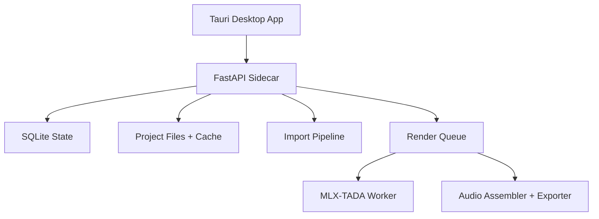

# Backend TRD

- Status: Accepted
- Date: 2026-04-12
- Owners: Backend implementation agents

## 1. Purpose

Define the local runtime architecture for Audaisy v1: manuscript ingestion, canonical document storage, render orchestration, audio assembly, export, and recovery.

The backend is a local Python service launched by Tauri. It owns all persistent state and all side effects outside the desktop shell itself.

## 2. Runtime Topology



## 3. Core Requirements

- Run entirely locally on macOS.
- Support a single active render job at a time on `16 GB` hardware.
- Default to `mlx-tada-3b` in `4-bit quantized` mode.
- Persist enough state to recover project data and render job progress after an app restart.
- Use a richer canonical document model than markdown alone.
- Keep import and render artifacts on disk so the runtime never needs to hold the full book audio in memory.

## 4. Process Model

### 4.1 Sidecar Process

The sidecar is a `FastAPI` app running as one OS process supervised by Tauri.

Responsibilities:

- Expose HTTP APIs
- Expose `SSE` events
- Own `SQLite` connections
- Schedule and serialize background work
- Spawn or manage the model worker

### 4.2 Model Worker

The model worker is a long-lived child process or dedicated runtime thread with exclusive ownership of the loaded `MLX-TADA` model.

Rules:

- Only one model worker exists in v1.
- Only one render segment is active at a time.
- The worker loads `mlx-tada-3b` quantized by default and may fall back to `mlx-tada-1b` only if a capability check or repeated OOM failure marks `3B` as unavailable on that machine.

## 5. Filesystem Layout

All data is stored beneath the Tauri app data root. Example layout:

```text
appDataDir/
  audaisy.sqlite3
  logs/
    runtime.log
  cache/
    models/
      mlx-tada-3b/
      mlx-tada-1b/
    voices/
      preset-<voiceId>.npz
  projects/
    <projectId>/
      originals/
      normalized/
      chapters/
        <chapterId>.md
        <chapterId>.json
      audio/
        segments/
        books/
      exports/
```

Rules:

- `originals/` stores the imported source files unchanged.
- `normalized/` stores conversion outputs such as Docling JSON or Pandoc artifacts.
- `chapters/*.json` stores canonical editor documents; `chapters/*.md` stores markdown projections.
- `audio/segments/` stores segment-level canonical `WAV` files.
- `audio/books/` stores assembled book-level or chapter-level `WAV` outputs before final export.

## 6. Persistent Data Model

### 6.1 SQLite Tables

```sql
projects(
  id TEXT PRIMARY KEY,
  title TEXT NOT NULL,
  default_voice_preset_id TEXT,
  created_at TEXT NOT NULL,
  updated_at TEXT NOT NULL,
  last_opened_at TEXT
);

chapters(
  id TEXT PRIMARY KEY,
  project_id TEXT NOT NULL,
  title TEXT NOT NULL,
  chapter_order INTEGER NOT NULL,
  markdown_path TEXT NOT NULL,
  editor_doc_path TEXT NOT NULL,
  document_record_id TEXT,
  created_at TEXT NOT NULL,
  updated_at TEXT NOT NULL
);

document_records(
  id TEXT PRIMARY KEY,
  project_id TEXT NOT NULL,
  source_file_name TEXT NOT NULL,
  source_mime_type TEXT NOT NULL,
  source_sha256 TEXT NOT NULL,
  canonical_json_path TEXT NOT NULL,
  markdown_projection_path TEXT NOT NULL,
  confidence TEXT NOT NULL,
  created_at TEXT NOT NULL
);

import_warnings(
  id TEXT PRIMARY KEY,
  chapter_id TEXT NOT NULL,
  code TEXT NOT NULL,
  severity TEXT NOT NULL,
  message TEXT NOT NULL,
  source_page INTEGER,
  block_id TEXT
);

voice_presets(
  id TEXT PRIMARY KEY,
  name TEXT NOT NULL,
  language TEXT NOT NULL,
  reference_asset_path TEXT NOT NULL,
  cached_reference_path TEXT,
  created_at TEXT NOT NULL
);

render_jobs(
  id TEXT PRIMARY KEY,
  project_id TEXT NOT NULL,
  chapter_id TEXT,
  scope TEXT NOT NULL,
  status TEXT NOT NULL,
  voice_preset_id TEXT NOT NULL,
  model_tier TEXT NOT NULL,
  target_export_kind TEXT,
  error_code TEXT,
  error_message TEXT,
  created_at TEXT NOT NULL,
  updated_at TEXT NOT NULL
);

segments(
  id TEXT PRIMARY KEY,
  render_job_id TEXT NOT NULL,
  chapter_id TEXT NOT NULL,
  text TEXT NOT NULL,
  block_ids_json TEXT NOT NULL,
  segment_order INTEGER NOT NULL,
  estimated_duration_sec REAL,
  status TEXT NOT NULL,
  audio_path TEXT,
  started_at TEXT,
  completed_at TEXT
);

runtime_settings(
  key TEXT PRIMARY KEY,
  value_json TEXT NOT NULL
);
```

Required indexes:

- `chapters(project_id, chapter_order)`
- `render_jobs(project_id, created_at DESC)`
- `segments(render_job_id, segment_order)`
- `import_warnings(chapter_id)`

### 6.2 Domain Schemas

```ts
type ProseMirrorJSON = {
  type: string
  attrs?: Record<string, unknown>
  content?: ProseMirrorJSON[]
  marks?: { type: string; attrs?: Record<string, unknown> }[]
  text?: string
}

type ChapterSummary = {
  id: string
  title: string
  order: number
  warningCount: number
}

type ImportWarning = {
  id: string
  code: string
  severity: "info" | "warning" | "error"
  message: string
  sourcePage?: number
  blockId?: string
}

type Project = {
  id: string
  title: string
  chapters: ChapterSummary[]
  defaultVoicePresetId: string | null
  createdAt: string
  updatedAt: string
}

type Chapter = {
  id: string
  projectId: string
  title: string
  order: number
  markdown: string
  editorDoc: ProseMirrorJSON
  documentRecordId: string | null
  importWarnings: ImportWarning[]
}

type DocumentRecord = {
  id: string
  sourceFileName: string
  sourceMimeType: string
  sourceSha256: string
  canonicalJson: object
  markdownProjection: string
  confidence: "high" | "medium" | "low"
}

type VoicePreset = {
  id: string
  name: string
  language: string
  referenceAssetPath: string
  cachedReferencePath: string | null
}

type RenderJob = {
  id: string
  projectId: string
  chapterId: string | null
  scope: "selection" | "chapter" | "book" | "segment"
  status: "queued" | "running" | "assembling" | "completed" | "failed" | "cancelled"
  voicePresetId: string
  modelTier: "tada-3b-q4" | "tada-1b-q4"
  createdAt: string
  updatedAt: string
}

type Segment = {
  id: string
  renderJobId: string
  chapterId: string
  blockIds: string[]
  text: string
  order: number
  status: "queued" | "running" | "completed" | "failed"
  audioPath: string | null
}
```

## 7. Import Pipeline

### 7.1 Supported Inputs

Supported in v1:

- `.md`
- `.txt`
- `.docx`
- `.epub`
- text-based `.pdf`

Rejected in v1:

- scanned PDFs
- image-only inputs
- audio or video inputs
- arbitrary office or archive formats

### 7.2 Import Routing

- `md`, `txt`: parse directly into markdown and `mdast`, then map to canonical chapter blocks.
- `docx`: convert with Mammoth to sanitized HTML, then normalize into the canonical document representation.
- `epub`: convert with Pandoc to an intermediate AST, then normalize into chapter blocks.
- `pdf`: convert with Docling and retain both lossless JSON and markdown projection.

### 7.3 Canonicalization Rules

- The backend owns the canonical `DocumentRecord`.
- Chapters are produced from the canonical import result, not from raw file lines.
- Every renderable block receives a stable `blockId`.
- Import confidence is set per chapter and warning, not only per book.
- The runtime must preserve provenance enough to surface warning context later.

## 8. Segmentation and Rendering

### 8.1 Render Job Creation

Input scopes:

- `selection`
- `chapter`
- `book`
- `segment`

Rules:

- `selection` render jobs must provide resolved `blockIds` plus exact selected text.
- `chapter` and `book` jobs are expanded into ordered segment lists by the runtime.
- The UI never sends arbitrary chunk boundaries. The backend owns final segment construction.

### 8.2 Segmentation Policy

- Split only on sentence boundaries and block boundaries.
- Target roughly `20-40` seconds of audio per segment.
- Aim for `150-350` words per segment.
- Keep headings separate from body paragraphs when they act as clear prosodic boundaries.
- Never span chapter boundaries in one segment.

### 8.3 Model Policy

- Default model tier: `tada-3b-q4`
- Fallback model tier: `tada-1b-q4`

The fallback is a runtime safety policy, not a second user-facing architecture. The UI may show which tier ran, but the backend remains single-path from an implementation perspective.

### 8.4 Audio Assembly

Pipeline:

1. Render each segment to `24 kHz WAV`
2. Persist each segment to disk immediately
3. Assemble ordered segments into a chapter or book master `WAV`
4. Apply light seam smoothing between segments
5. Apply whole-program loudness normalization once
6. Export to user-requested formats

## 9. Export Requirements

Supported export targets:

- `wav`
- `mp3`
- `m4b`

Rules:

- `WAV` is the canonical internal audio format.
- `MP3` is a convenience export.
- `M4B` must support chapter markers for chapter-level book exports.
- Export jobs reuse completed assembled masters where possible instead of re-rendering segments.

## 10. Failure and Recovery

- If the sidecar stops unexpectedly, incomplete segments remain on disk and job status remains recoverable from `SQLite`.
- On restart, the runtime reconciles segment files against segment table rows before resuming or marking the job failed.
- If the model worker OOMs, the runtime records the failure reason and decides whether a one-time fallback to `1B` is allowed by machine capability policy.
- Failed imports must preserve the original uploaded file and store a human-readable failure reason.

## 11. Security and Privacy

- All processing is local-only after model download.
- Uploaded files never leave the machine.
- Logs must not include full manuscript text by default.
- Crash and error logs may include IDs, paths, and exception traces, but not raw chapter bodies unless debug mode is explicitly enabled.

## 12. Ownership Boundaries

Backend agents own:

- FastAPI app
- SQLite schema and migrations
- Filesystem layout and persistence
- Import conversion orchestration
- Render queue and worker management
- Audio assembly and export

Backend agents do not own:

- Tauri process launch logic
- React routing and UI state management
- Editor view composition
