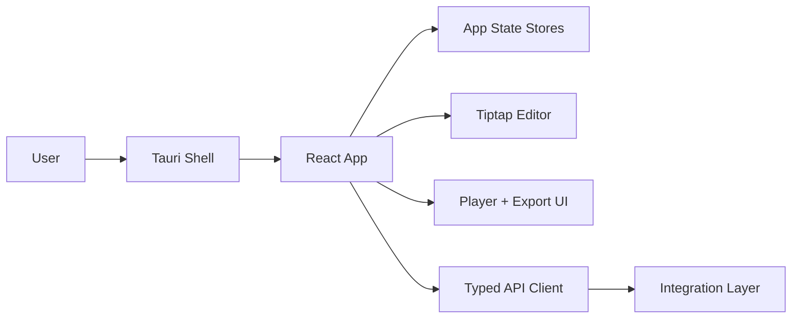
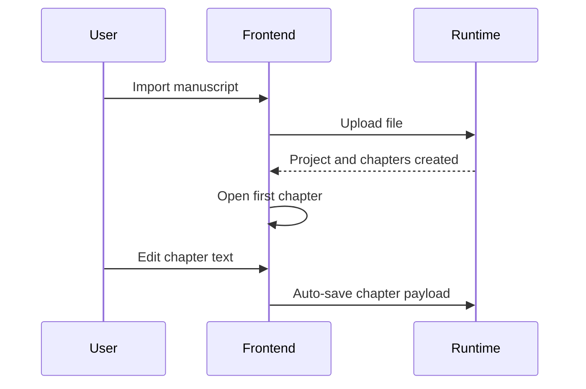
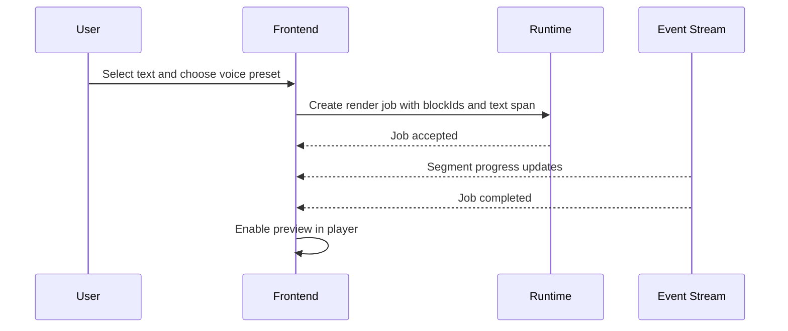

# Frontend TRD

- Status: Accepted
- Date: 2026-04-12
- Owners: Frontend implementation agents

## 1. Purpose

Define the user-facing macOS desktop experience for Audaisy v1, including onboarding, manuscript editing, render initiation, playback, and export surfaces.

The frontend is responsible for presentation, local interaction state, and deterministic use of the shared integration contracts. It is not responsible for file conversion, TTS orchestration, or model lifecycle logic.

## 2. Product Goals

- Let a user create and manage a local audiobook project as a `Book` with ordered `Chapter` objects.
- Provide a notebook-like workspace where chapters are easy to switch, edit, render, and preview.
- Keep voice and rendering controls in the chapter workspace instead of burying them in a global settings page.
- Surface long-running local operations clearly without blocking editing.
- Preserve a shell-agnostic React architecture, while targeting Tauri-only desktop bindings.

## 3. Non-Goals

- Multi-user collaboration
- Cloud sync
- Browser-hosted deployment in v1
- Full DAISY authoring UI
- Custom voice training or unrestricted voice cloning UX

## 4. Primary Views

### 4.1 Onboarding

Used on first run and whenever runtime readiness is incomplete.

Required capabilities:

- Check runtime health
- Detect model availability
- Start gated model download flow
- Show disk-space and memory readiness messages
- Prevent entry into the workspace until minimum runtime readiness is satisfied

### 4.2 Library View

Shows local books with summary metadata and last-opened state.

Required capabilities:

- Create book
- Open book
- Rename book
- Delete book with confirmation
- Show render state badges if jobs are active

### 4.3 Book Workspace

This is the main surface of the product.

Layout:

- Left sidebar: book metadata, ordered chapter list, import actions, add/reorder chapter actions
- Center canvas: chapter tabs and chapter editor
- Right drawer: voice preset, render scope, render options, import warnings, chapter metadata
- Bottom bar: persistent player, active render job state, export actions

### 4.4 Export Surface

Accessible from the bottom bar and book toolbar.

Required capabilities:

- Export `WAV`
- Export `MP3`
- Export chaptered `M4B`
- Show export progress and output location

## 5. Frontend Architecture



### 5.1 Module Boundaries

- `app-shell`: routes, window-level layout, theme, notifications
- `library`: project list, create/open/delete flows
- `workspace`: chapter list, tabs, import actions, chapter toolbar
- `editor`: Tiptap configuration, custom nodes, selection model, persistence adapters
- `rendering`: voice presets, render controls, active job panel, regeneration actions
- `playback`: waveform timeline, chapter preview, segment preview, seek and play state
- `runtime-status`: onboarding readiness, download progress, health errors
- `api-client`: generated or hand-maintained typed calls against the Integration TRD

Frontend code must keep these modules independent enough that they can be implemented by separate agents without modifying shared contracts.

## 6. Information Architecture

### 6.1 Navigation Model

- `/onboarding`
- `/library`
- `/projects/:projectId`

There is no deep route for a chapter. The active chapter is stored in app state so the workspace can restore the last viewed chapter without fragmenting the router around editor internals.

### 6.2 Workspace Hierarchy

```text
Book
  Chapter 1
  Chapter 2
  Chapter 3
```

Each chapter is a separately editable manuscript unit with its own editor state, import warnings, and render actions.

## 7. State Requirements

The frontend must maintain the following state domains.

```ts
type ProjectCard = {
  id: string
  title: string
  chapterCount: number
  lastOpenedAt: string | null
  activeJobCount: number
}

type ImportWarning = {
  id: string
  code: string
  severity: "info" | "warning" | "error"
  message: string
  sourcePage?: number
  blockId?: string
}

type RuntimeReadiness = {
  healthy: boolean
  modelsReady: boolean
  minimumDiskFreeBytes: number
  availableDiskBytes: number
  canRun3BQuantized: boolean
  blockingIssues: string[]
}

type LibraryState = {
  projects: ProjectCard[]
  activeProjectId: string | null
  loading: boolean
}

type WorkspaceState = {
  project: Project | null
  activeChapterId: string | null
  dirtyChapterIds: string[]
  rightDrawerTab: "voice" | "warnings" | "metadata"
}

type EditorSelectionState = {
  chapterId: string
  from: number
  to: number
  blockIds: string[]
  selectedText: string
}

type PlaybackState = {
  status: "idle" | "loading" | "playing" | "paused"
  sourceType: "segment" | "chapter" | "book" | null
  sourceId: string | null
  currentTimeSec: number
  durationSec: number
}

type ActiveJobState = {
  jobs: RenderJob[]
  latestEventId: string | null
  connected: boolean
}
```

Rules:

- `WorkspaceState` is the source of truth for visible project context.
- The editor owns transient selection details, but selected render targets must be normalized into `blockIds` before dispatching render requests.
- `ActiveJobState` is hydrated from `SSE` plus cold-start polling on boot.

## 8. Editor Requirements

### 8.1 Canonical Editor Model

The frontend editor model is `Tiptap` backed by `ProseMirror JSON`.

Supported nodes in v1:

- `doc`
- `heading`
- `paragraph`
- `blockquote`
- `bulletList`
- `orderedList`
- `listItem`
- `codeBlock`
- `horizontalRule`
- `hardBreak`
- `text`

Required marks in v1:

- `bold`
- `italic`
- `code`
- `link`

### 8.2 Required Block Attributes

Every block-level node that can be segmented for TTS must include:

```ts
type BlockAttrs = {
  blockId: string
  sourceDocumentRecordId?: string
  sourceOriginId?: string
  importConfidence?: "high" | "medium" | "low"
}
```

Rules:

- `blockId` is generated once and preserved through local edits where the block identity still makes sense.
- Splitting a block creates new `blockId` values for new descendant blocks.
- Pure text edits inside a block must not reassign the `blockId`.

### 8.3 Editor Behavior

- Auto-save chapter changes within `500 ms` of idle time.
- Persist editor content as both `editorDoc` and markdown projection via the shared API.
- Support selection-based render actions from the current selection toolbar and chapter toolbar.
- Display import warnings in the workspace drawer, not inline in the text body.
- Keep the editor usable while render jobs are running.

## 9. Primary Interaction Flows

### 9.1 Import and Edit



### 9.2 Render Selection



## 10. Error Handling Requirements

- If runtime health is lost, freeze new render/export actions and display a non-dismissable status banner.
- If a chapter save fails, keep dirty state in memory and retry automatically with exponential backoff.
- If `SSE` disconnects, reconnect automatically and reconcile state via `GET /render-jobs`.
- If import warnings exist, show a persistent badge on the chapter and book workspace.
- If model download is incomplete, redirect to onboarding instead of letting the user fail deep in the render flow.

## 11. Performance Requirements

- Initial library load under `1 s` for up to `100` local books on SSD-backed storage.
- Project workspace hydration under `1.5 s` for a book with `20` chapters when no render job is active.
- Editor typing latency should remain visually smooth while background `SSE` events stream in.
- The player must start playback of a completed local audio asset within `250 ms` after user action.

## 12. Accessibility Requirements

- All major controls must be keyboard reachable.
- The chapter list, render buttons, and player controls must expose accessible labels.
- Toast-only state changes are insufficient. Render failures and blocking runtime issues must have persistent visible text.

## 13. Ownership Boundaries

Frontend agents own:

- React routes and view composition
- Tiptap configuration and editor behavior
- Local UI state stores
- Playback controls and export affordances
- Rendering and import status surfaces

Frontend agents do not own:

- File conversion logic
- Segmentation logic
- Render queue orchestration
- Model download/install logic beyond calling the runtime contracts
