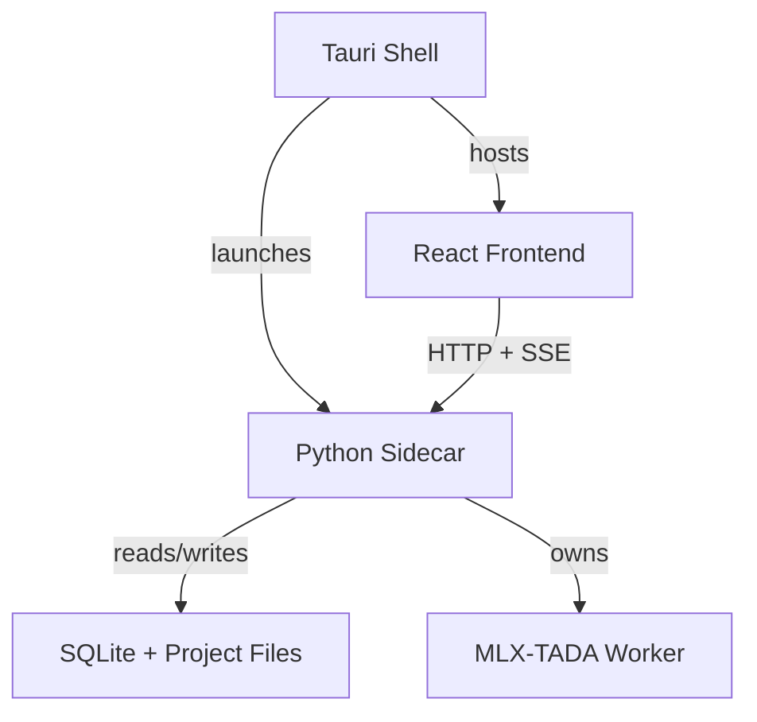
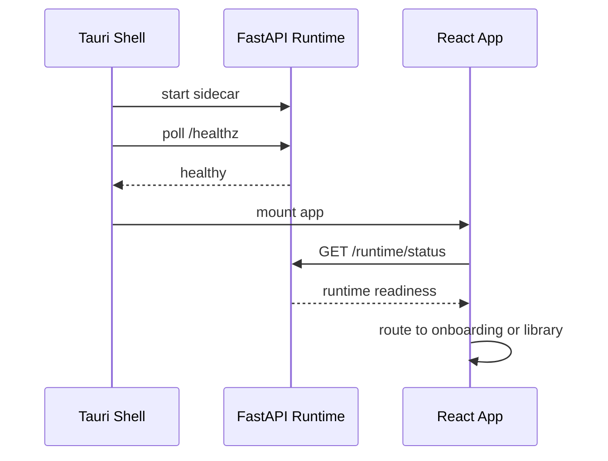
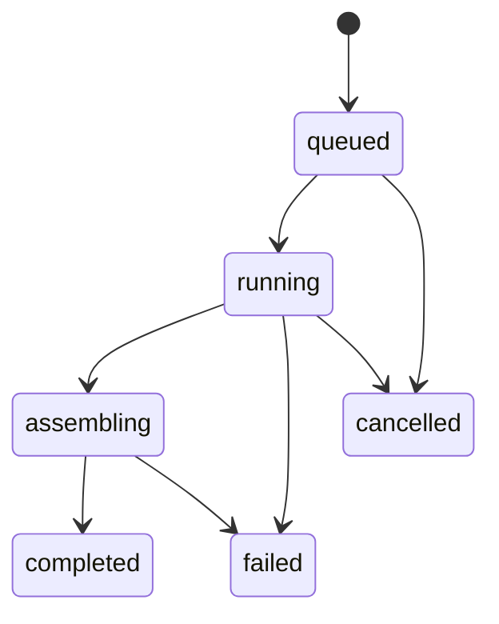

# Integration TRD

- Status: Accepted
- Date: 2026-04-12
- Owners: Integration implementation agents

## 1. Purpose

Define the contracts and lifecycle rules between the Tauri shell, React frontend, and Python runtime.

This document is the integration source of truth. Frontend and backend implementations must conform to it instead of inventing private compatibility layers.

## 2. Responsibilities by Layer

| Layer | Responsibilities | Must Not Own |
| --- | --- | --- |
| Tauri shell | Sidecar launch, health checks, filesystem dialogs, app lifecycle, window/menu integration | Business logic, document conversion, render orchestration |
| React app | UI composition, local view state, editor interactions, playback controls, invoking typed contracts | Local runtime process management, file parsing, queue logic |
| FastAPI runtime | Persistence, import, segmentation, rendering, export, progress events | Window lifecycle, native menu bindings, view state |

## 3. Deployment Topology



## 4. Startup and Shutdown Lifecycle

### 4.1 Startup Sequence



Rules:

- Tauri must not mount the main workspace until `/healthz` succeeds or a startup error boundary is shown.
- React must call `GET /runtime/status` before deciding whether to route to `/onboarding` or `/library`.

### 4.2 Shutdown Sequence

- React stops initiating new requests.
- Tauri signals the sidecar for graceful shutdown.
- The runtime marks any currently running segment as interrupted before process exit.
- The worker unloads cleanly where possible; otherwise the next boot performs reconciliation.

## 5. Shared Contract Package

Create one shared contract module in the repo and version it independently from implementation packages.

Required contents:

- Domain types
- Request and response types
- `SSE` event types
- Error code enums
- Version string exported as `CONTRACT_VERSION`

Versioning rules:

- Additive fields are allowed in minor versions.
- Removing or renaming fields requires a major contract bump.
- Tauri startup must fail fast if the frontend and runtime report incompatible contract versions.

## 6. HTTP API Surface

The runtime exposes localhost-only HTTP APIs.

### 6.1 Health and Readiness

| Method | Path | Purpose |
| --- | --- | --- |
| `GET` | `/healthz` | Liveness for Tauri startup |
| `GET` | `/runtime/status` | Model availability, disk, capability, and health summary |
| `POST` | `/runtime/models/download` | Start first-run model download |

### 6.2 Projects and Chapters

| Method | Path | Purpose |
| --- | --- | --- |
| `GET` | `/projects` | List local books |
| `POST` | `/projects` | Create a new book |
| `GET` | `/projects/{projectId}` | Load project details |
| `PATCH` | `/projects/{projectId}` | Rename or update project defaults |
| `DELETE` | `/projects/{projectId}` | Delete a local project |
| `POST` | `/projects/{projectId}/imports` | Import manuscript files into the book |
| `POST` | `/projects/{projectId}/chapters` | Add chapter manually |
| `PATCH` | `/chapters/{chapterId}` | Persist editor content and metadata |
| `POST` | `/chapters/reorder` | Update chapter ordering |

### 6.3 Voices, Rendering, and Export

| Method | Path | Purpose |
| --- | --- | --- |
| `GET` | `/voice-presets` | List built-in voice presets |
| `POST` | `/render-jobs` | Create render job |
| `GET` | `/render-jobs` | List recent jobs |
| `GET` | `/render-jobs/{jobId}` | Get job details |
| `POST` | `/render-jobs/{jobId}/cancel` | Cancel queued or active job |
| `POST` | `/segments/{segmentId}/regenerate` | Re-render one completed or failed segment |
| `POST` | `/exports` | Export completed audio |

### 6.4 Example Request Types

```ts
type ProseMirrorJSON = {
  type: string
  attrs?: Record<string, unknown>
  content?: ProseMirrorJSON[]
  marks?: { type: string; attrs?: Record<string, unknown> }[]
  text?: string
}

type ChapterSummary = {
  id: string
  title: string
  order: number
  warningCount: number
}

type ImportWarning = {
  id: string
  code: string
  severity: "info" | "warning" | "error"
  message: string
  sourcePage?: number
  blockId?: string
}

type RuntimeStatusResponse = {
  healthy: boolean
  modelsReady: boolean
  activeModelTier: "tada-3b-q4" | "tada-1b-q4" | null
  canRun3BQuantized: boolean
  availableDiskBytes: number
  minimumDiskFreeBytes: number
  blockingIssues: string[]
}

type CreateProjectRequest = {
  title: string
}

type UpdateChapterRequest = {
  markdown: string
  editorDoc: ProseMirrorJSON
}

type CreateRenderJobRequest = {
  projectId: string
  chapterId: string | null
  scope: "selection" | "chapter" | "book" | "segment"
  voicePresetId: string
  selection?: {
    blockIds: string[]
    text: string
  }
}

type CreateExportRequest = {
  projectId: string
  sourceJobId: string
  format: "wav" | "mp3" | "m4b"
}

type ProjectResponse = {
  id: string
  title: string
  chapters: ChapterSummary[]
  defaultVoicePresetId: string | null
  createdAt: string
  updatedAt: string
}

type ChapterResponse = {
  id: string
  projectId: string
  title: string
  order: number
  markdown: string
  editorDoc: ProseMirrorJSON
  documentRecordId: string | null
  importWarnings: ImportWarning[]
}
```

## 7. SSE Event Contract

The runtime must expose a single stream at `GET /events`.

Rules:

- Events are append-only notifications, not the only source of truth.
- The UI must reconcile on reconnect by calling relevant list endpoints.
- Every event must contain `eventId`, `eventType`, and `emittedAt`.

```ts
type RuntimeEvent =
  | {
      eventId: string
      eventType: "job.updated"
      emittedAt: string
      job: RenderJob
    }
  | {
      eventId: string
      eventType: "segment.updated"
      emittedAt: string
      segment: Segment
    }
  | {
      eventId: string
      eventType: "model.download.progress"
      emittedAt: string
      receivedBytes: number
      totalBytes: number | null
    }
  | {
      eventId: string
      eventType: "runtime.error"
      emittedAt: string
      code: string
      message: string
    }
```

## 8. Job Lifecycle



Rules:

- A job enters `running` when the first segment begins inference.
- A job enters `assembling` only after all required segments complete successfully.
- A cancelled job keeps completed segment files on disk until cleanup policies remove them.

## 9. First-Run Model Onboarding

The first-run path is a cross-layer responsibility.

### 9.1 Tauri Responsibilities

- Launch the runtime
- Provide file-system-safe paths for the runtime root
- Keep the onboarding window stable during long downloads

### 9.2 React Responsibilities

- Present gating and progress UI
- Offer retry and resume actions
- Prevent navigation into the editor until minimum readiness is satisfied

### 9.3 Runtime Responsibilities

- Check whether model assets exist
- Validate model checksums
- Verify free disk space and machine capability
- Emit download progress over `SSE`
- Mark readiness state in `/runtime/status`

## 10. Restart and Recovery Rules

- On boot, the runtime inspects `render_jobs` with `queued`, `running`, or `assembling` status.
- It reconciles segment rows with the filesystem before exposing job state to the UI.
- Jobs interrupted during `running` may either resume remaining segments or be marked `failed` with a resumable action, but the policy must be consistent and deterministic across boots.
- Completed exports remain visible as long as their output files still exist.

Recommended v1 policy:

- Resume `queued` jobs automatically.
- Convert `running` jobs to `failed` with `error_code = "INTERRUPTED"` and allow explicit user retry.
- Rebuild `assembling` jobs if all segment WAVs still exist; otherwise fail them with a recovery hint.

## 11. Responsibility Boundaries for Shared Data

- The frontend may cache project and job data locally for responsiveness, but the runtime remains the source of truth.
- The frontend may not invent local-only job states.
- The runtime may not mutate editor structure in response to a render request.
- The Tauri shell may not implement its own persistence layer beyond sidecar launch metadata and user-selected paths.

## 12. Observability

- Tauri logs sidecar launch success, failure, and shutdown reason.
- The runtime logs request IDs, job IDs, segment IDs, model tier, and high-level pipeline stage transitions.
- Frontend logs are for developer diagnostics only and must not be treated as durable state.

## 13. Acceptance Criteria

- A frontend agent can implement the UI without guessing endpoint shapes or event semantics.
- A backend agent can implement the runtime without guessing startup lifecycle or recovery rules.
- An integration agent can own Tauri bootstrap and contract enforcement without re-architecting either side.
- The three layers interact only through the contracts and lifecycle defined here.
